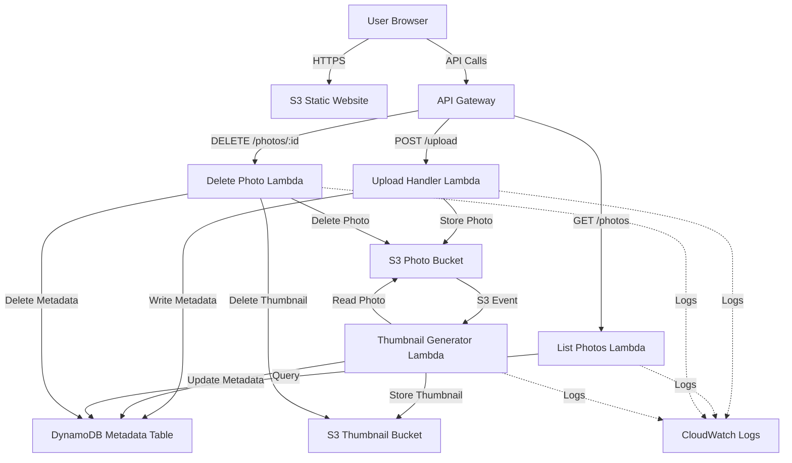

# Design Document: AWS Serverless Photo Gallery

## Overview

The AWS Serverless Photo Gallery is a fully serverless web application that enables users to upload, view, manage, and search photos through a browser-based interface. The architecture leverages AWS managed services to eliminate server management while providing automatic scaling, high availability, and cost efficiency.

The system consists of three primary layers:

1. **Presentation Layer**: Static website hosted on S3 serving HTML, CSS, and JavaScript
2. **API Layer**: API Gateway providing REST endpoints that route requests to Lambda functions
3. **Data Layer**: S3 buckets for photo storage and DynamoDB for metadata persistence

The application follows an event-driven architecture where photo uploads trigger automatic thumbnail generation through S3 event notifications. All compute operations are handled by Lambda functions written in Python, ensuring stateless execution and automatic scaling.

## Architecture

### High-Level Architecture



### Component Interaction Flow

**Upload Flow:**
1. User selects photo in web interface
2. Frontend sends POST request to API Gateway `/upload` endpoint
3. Upload Handler Lambda generates presigned S3 URL
4. Frontend uploads photo directly to S3 using presigned URL
5. S3 triggers Thumbnail Generator Lambda via event notification
6. Thumbnail Generator creates thumbnail and stores in Thumbnail Bucket
7. Thumbnail Generator writes metadata to DynamoDB
8. Frontend polls or receives confirmation of successful upload

**Gallery Display Flow:**
1. User loads gallery page
2. Frontend sends GET request to API Gateway `/photos` endpoint
3. List Handler Lambda queries DynamoDB for all photo metadata
4. Lambda returns list with thumbnail URLs and metadata
5. Frontend renders gallery grid with thumbnails from S3

**Delete Flow:**
1. User clicks delete button on photo
2. Frontend sends DELETE request to API Gateway `/photos/:id` endpoint
3. Delete Handler Lambda removes photo from Photo Bucket
4. Lambda removes thumbnail from Thumbnail Bucket
5. Lambda deletes metadata record from DynamoDB
6. Lambda returns success response
7. Frontend removes photo from gallery display

## Components and Interfaces

### Frontend (Static Website)

**Technology:** HTML5, CSS3, Vanilla JavaScript

**Files:**
- `index.html`: Main page structure with gallery grid and upload form
- `styles.css`: Responsive styling for gallery layout and UI components
- `app.js`: Client-side logic for API calls, file uploads, and UI interactions

**Key Functions:**
- `uploadPhoto(file)`: Handles photo upload process with presigned URL
- `loadGallery()`: Fetches and displays photo list from API
- `deletePhoto(photoId)`: Sends delete request and updates UI
- `filterPhotos(searchTerm)`: Client-side filtering of displayed photos
- `viewFullSize(photoId)`: Opens modal with full-size photo

**API Integration:**
- Base URL configured for API Gateway endpoint
- CORS-enabled requests to backend
- Error handling for network failures and API errors

### API Gateway

**Type:** REST API

**Endpoints:**

1. **POST /upload**
   - Purpose: Generate presigned URL for photo upload
   - Request: `{ "filename": string, "contentType": string }`
   - Response: `{ "uploadUrl": string, "photoId": string, "key": string }`
   - Lambda: Upload Handler

2. **GET /photos**
   - Purpose: Retrieve list of all photos with metadata
   - Request: None (query parameters optional for future filtering)
   - Response: `{ "photos": [{ "photoId": string, "filename": string, "uploadDate": string, "thumbnailUrl": string, "photoUrl": string, "tags": string[] }] }`
   - Lambda: List Handler

3. **DELETE /photos/{photoId}**
   - Purpose: Delete photo and associated data
   - Request: Path parameter `photoId`
   - Response: `{ "message": string, "photoId": string }`
   - Lambda: Delete Handler

**Configuration:**
- CORS enabled for frontend domain
- Request validation for required parameters
- Error responses with appropriate HTTP status codes
- CloudWatch logging enabled

### Lambda Functions

#### Upload Handler

**Runtime:** Python 3.11

**Purpose:** Generate presigned S3 URLs for direct photo uploads

**Input:**
```python
{
    "filename": str,
    "contentType": str
}
```

**Output:**
```python
{
    "uploadUrl": str,
    "photoId": str,
    "key": str
}
```

**Logic:**
1. Validate content type is image format (image/jpeg, image/png, image/gif)
2. Generate unique photo ID using UUID
3. Construct S3 key: `photos/{photoId}/{filename}`
4. Generate presigned POST URL with 5-minute expiration
5. Return presigned URL and metadata to frontend

**IAM Permissions:**
- `s3:PutObject` on Photo Bucket
- `logs:CreateLogGroup`, `logs:CreateLogStream`, `logs:PutLogEvents`

**Environment Variables:**
- `PHOTO_BUCKET_NAME`: Name of S3 bucket for photos

#### Thumbnail Generator

**Runtime:** Python 3.11

**Purpose:** Automatically create thumbnails when photos are uploaded

**Trigger:** S3 Event Notification (ObjectCreated) on Photo Bucket

**Dependencies:** Pillow (PIL) library for image processing

**Input:** S3 event notification
```python
{
    "Records": [{
        "s3": {
            "bucket": {"name": str},
            "object": {"key": str}
        }
    }]
}
```

**Logic:**
1. Extract bucket name and object key from S3 event
2. Download photo from S3 to Lambda /tmp directory
3. Open image with Pillow
4. Calculate thumbnail dimensions (max 200x200, maintain aspect ratio)
5. Resize image using LANCZOS resampling
6. Save thumbnail to /tmp
7. Upload thumbnail to Thumbnail Bucket with key: `thumbnails/{photoId}/{filename}`
8. Extract metadata (file size, dimensions, upload timestamp)
9. Write metadata to DynamoDB including photo key, thumbnail key, and extracted data
10. Clean up /tmp files

**IAM Permissions:**
- `s3:GetObject` on Photo Bucket
- `s3:PutObject` on Thumbnail Bucket
- `dynamodb:PutItem` on Metadata Table
- `logs:CreateLogGroup`, `logs:CreateLogStream`, `logs:PutLogEvents`

**Environment Variables:**
- `PHOTO_BUCKET_NAME`: Name of S3 bucket for photos
- `THUMBNAIL_BUCKET_NAME`: Name of S3 bucket for thumbnails
- `METADATA_TABLE_NAME`: Name of DynamoDB table
- `THUMBNAIL_MAX_SIZE`: Maximum thumbnail dimension (default: 200)

**Error Handling:**
- Log errors to CloudWatch
- Continue execution even if thumbnail generation fails
- Store error status in metadata if processing fails

#### List Handler

**Runtime:** Python 3.11

**Purpose:** Retrieve all photo metadata for gallery display

**Input:** None (future: query parameters for filtering)

**Output:**
```python
{
    "photos": [
        {
            "photoId": str,
            "filename": str,
            "uploadDate": str,
            "fileSize": int,
            "thumbnailUrl": str,
            "photoUrl": str,
            "tags": list[str],
            "dimensions": {"width": int, "height": int}
        }
    ]
}
```

**Logic:**
1. Scan DynamoDB Metadata Table (future: use Query with GSI for filtering)
2. For each item, generate presigned URLs or construct public URLs for photo and thumbnail
3. Format response with all metadata
4. Return sorted by upload date (newest first)

**IAM Permissions:**
- `dynamodb:Scan` on Metadata Table
- `s3:GetObject` on Photo Bucket and Thumbnail Bucket (for presigned URLs)
- `logs:CreateLogGroup`, `logs:CreateLogStream`, `logs:PutLogEvents`

**Environment Variables:**
- `METADATA_TABLE_NAME`: Name of DynamoDB table
- `PHOTO_BUCKET_NAME`: Name of S3 bucket for photos
- `THUMBNAIL_BUCKET_NAME`: Name of S3 bucket for thumbnails
- `URL_EXPIRATION`: Presigned URL expiration time in seconds (default: 3600)

#### Delete Handler

**Runtime:** Python 3.11

**Purpose:** Delete photo, thumbnail, and metadata

**Input:**
```python
{
    "photoId": str
}
```

**Output:**
```python
{
    "message": str,
    "photoId": str
}
```

**Logic:**
1. Query DynamoDB for photo metadata using photoId
2. Extract S3 keys for photo and thumbnail
3. Delete photo from Photo Bucket
4. Delete thumbnail from Thumbnail Bucket
5. Delete metadata record from DynamoDB
6. Return success response

**Error Handling:**
- If photo not found in DynamoDB, return 404 error
- If S3 deletion fails, log error but continue
- If DynamoDB deletion fails, return error response

**IAM Permissions:**
- `dynamodb:GetItem`, `dynamodb:DeleteItem` on Metadata Table
- `s3:DeleteObject` on Photo Bucket and Thumbnail Bucket
- `logs:CreateLogGroup`, `logs:CreateLogStream`, `logs:PutLogEvents`

**Environment Variables:**
- `METADATA_TABLE_NAME`: Name of DynamoDB table
- `PHOTO_BUCKET_NAME`: Name of S3 bucket for photos
- `THUMBNAIL_BUCKET_NAME`: Name of S3 bucket for thumbnails

## Data Models

### DynamoDB Metadata Table

**Table Name:** `photo-gallery-metadata`

**Primary Key:**
- Partition Key: `photoId` (String) - UUID generated for each photo

**Attributes:**
- `photoId` (String): Unique identifier for the photo
- `filename` (String): Original filename of uploaded photo
- `uploadDate` (String): ISO 8601 timestamp of upload
- `fileSize` (Number): Size of original photo in bytes
- `contentType` (String): MIME type of photo (e.g., "image/jpeg")
- `photoKey` (String): S3 key for original photo
- `thumbnailKey` (String): S3 key for thumbnail
- `tags` (List): Array of tag strings (optional)
- `dimensions` (Map): Original photo dimensions
  - `width` (Number): Width in pixels
  - `height` (Number): Height in pixels
- `thumbnailDimensions` (Map): Thumbnail dimensions
  - `width` (Number): Width in pixels
  - `height` (Number): Height in pixels
- `processingStatus` (String): Status of thumbnail generation ("pending", "completed", "failed")

**Capacity Mode:** On-demand (pay per request)

**Example Item:**
```json
{
    "photoId": "a1b2c3d4-e5f6-7890-abcd-ef1234567890",
    "filename": "sunset.jpg",
    "uploadDate": "2024-01-15T14:30:00Z",
    "fileSize": 2048576,
    "contentType": "image/jpeg",
    "photoKey": "photos/a1b2c3d4-e5f6-7890-abcd-ef1234567890/sunset.jpg",
    "thumbnailKey": "thumbnails/a1b2c3d4-e5f6-7890-abcd-ef1234567890/sunset.jpg",
    "tags": ["vacation", "beach"],
    "dimensions": {
        "width": 1920,
        "height": 1080
    },
    "thumbnailDimensions": {
        "width": 200,
        "height": 113
    },
    "processingStatus": "completed"
}
```

### S3 Bucket Structure

**Photo Bucket:** `photo-gallery-photos-{account-id}`
- Path pattern: `photos/{photoId}/{filename}`
- Versioning: Disabled
- Public access: Blocked (access via presigned URLs)
- Lifecycle: Optional archival to Glacier after 90 days

**Thumbnail Bucket:** `photo-gallery-thumbnails-{account-id}`
- Path pattern: `thumbnails/{photoId}/{filename}`
- Versioning: Disabled
- Public access: Enabled for read (or presigned URLs)
- Lifecycle: Delete after 30 days if photo deleted

**Frontend Bucket:** `photo-gallery-frontend-{account-id}`
- Contains: `index.html`, `styles.css`, `app.js`
- Static website hosting enabled
- Public read access for website files
- Index document: `index.html`


## Correctness Properties

*A property is a characteristic or behavior that should hold true across all valid executions of a system—essentially, a formal statement about what the system should do. Properties serve as the bridge between human-readable specifications and machine-verifiable correctness guarantees.*

### Property Reflection

After analyzing all acceptance criteria, I identified several areas where properties can be consolidated:

- Upload success/failure responses (1.5, 1.6) can be combined into a single property about response consistency
- Deletion operations (6.2, 6.3, 6.4) can be combined into a comprehensive deletion property
- Metadata completeness (3.1, 4.3) can be unified into a single property about metadata structure
- API routing (8.2, 8.3) represents basic integration behavior that can be combined

The following properties represent the unique, non-redundant correctness guarantees for the system:

### Upload Properties

**Property 1: Valid image upload acceptance**

*For any* valid image file (JPEG, PNG, or GIF format), when uploaded through the system, the photo should be stored in the Photo_Bucket and a unique photo ID should be generated.

**Validates: Requirements 1.1, 1.2, 1.3**

**Property 2: Invalid file rejection**

*For any* file with a non-image content type, when submitted for upload, the Upload_Handler should reject the request and return an error message describing the validation failure.

**Validates: Requirements 1.4, 1.6**

**Property 3: Upload ID uniqueness**

*For any* set of photo uploads, all generated photo IDs should be unique across the entire system.

**Validates: Requirements 1.2**

### Thumbnail Generation Properties

**Property 4: Thumbnail dimension constraints**

*For any* image processed by the Thumbnail_Generator, the resulting thumbnail should have maximum dimensions of 200x200 pixels while maintaining the original aspect ratio.

**Validates: Requirements 2.2**

**Property 5: Thumbnail storage consistency**

*For any* successfully generated thumbnail, it should be stored in the Thumbnail_Bucket with a key that references the original photo ID, and metadata should be written to the Metadata_Store.

**Validates: Requirements 2.3, 2.4**

**Property 6: Thumbnail generation resilience**

*For any* thumbnail generation failure, the system should log the error to CloudWatch and continue operation without blocking the original photo upload.

**Validates: Requirements 2.5, 11.2**

### Metadata Properties

**Property 7: Metadata completeness**

*For any* photo uploaded and processed, the stored metadata should include all required fields: photoId, filename, uploadDate, fileSize, photoKey, thumbnailKey, and dimensions.

**Validates: Requirements 3.1, 4.3**

**Property 8: Metadata write-read consistency**

*For any* metadata written to the Metadata_Store, a subsequent query by photoId should immediately return the same data (round-trip property).

**Validates: Requirements 3.2, 3.4**

**Property 9: Tag preservation**

*For any* photo upload that includes tags, those tags should be stored in the metadata and returned in subsequent queries.

**Validates: Requirements 3.3**

### Gallery Display Properties

**Property 10: Complete photo retrieval**

*For any* request to the List_Handler, the response should include metadata for all photos currently stored in the system, sorted by upload date.

**Validates: Requirements 4.2**

**Property 11: Response structure completeness**

*For any* photo in the list response, the data should include thumbnailUrl, photoUrl, photoId, filename, uploadDate, and any associated tags.

**Validates: Requirements 4.3, 4.5**

### Deletion Properties

**Property 12: Complete deletion**

*For any* photo deletion request with a valid photoId, the system should remove the photo from the Photo_Bucket, the thumbnail from the Thumbnail_Bucket, and the metadata from the Metadata_Store, then return a success response.

**Validates: Requirements 6.2, 6.3, 6.4, 6.5**

**Property 13: Deletion idempotence**

*For any* photoId, deleting it multiple times should not cause errors (the second deletion should handle the missing photo gracefully).

**Validates: Requirements 6.2, 6.3, 6.4**

### Search and Filter Properties

**Property 14: Tag search accuracy**

*For any* tag search term, the filtered results should include only photos whose tags contain the search term (case-insensitive substring match).

**Validates: Requirements 7.2**

**Property 15: Date range filtering**

*For any* date range filter, the displayed photos should include only those with uploadDate within the specified range (inclusive).

**Validates: Requirements 7.3**

### API Integration Properties

**Property 16: Error response consistency**

*For any* API request that results in an error, the response should include an appropriate HTTP status code (4xx for client errors, 5xx for server errors) and a descriptive error message.

**Validates: Requirements 1.6, 8.5**

### Logging Properties

**Property 17: Lambda execution logging**

*For any* Lambda function execution, execution details should be logged to CloudWatch including timestamp, request ID, and execution duration.

**Validates: Requirements 11.1**

**Property 18: Error logging completeness**

*For any* error occurring in a Lambda function, the CloudWatch logs should contain the error message and stack trace.

**Validates: Requirements 11.2**

### Concurrency Properties

**Property 19: Concurrent upload processing**

*For any* set of photos uploaded simultaneously, each should be processed independently and all should complete successfully without interference.

**Validates: Requirements 12.2**

## Error Handling

### Upload Handler Error Scenarios

1. **Invalid Content Type**
   - Detection: Check content type against allowed list (image/jpeg, image/png, image/gif)
   - Response: HTTP 400 with message "Invalid file type. Only JPEG, PNG, and GIF images are allowed."
   - Logging: Log warning with attempted content type

2. **Missing Required Parameters**
   - Detection: Validate presence of filename and contentType in request
   - Response: HTTP 400 with message "Missing required parameters: filename and contentType"
   - Logging: Log warning with request details

3. **S3 Presigned URL Generation Failure**
   - Detection: Catch boto3 exceptions during presigned URL generation
   - Response: HTTP 500 with message "Failed to generate upload URL. Please try again."
   - Logging: Log error with exception details and stack trace

### Thumbnail Generator Error Scenarios

1. **Invalid Image Format**
   - Detection: Pillow raises exception when opening corrupted or invalid image
   - Response: Update metadata with processingStatus="failed"
   - Logging: Log error with S3 key and exception details
   - Recovery: Continue execution, do not retry

2. **S3 Download Failure**
   - Detection: Catch boto3 exceptions during photo download
   - Response: Update metadata with processingStatus="failed"
   - Logging: Log error with S3 key and exception details
   - Recovery: Continue execution, do not retry

3. **Insufficient Memory**
   - Detection: Lambda runs out of memory processing large image
   - Response: Lambda timeout or memory error
   - Logging: CloudWatch captures Lambda error
   - Recovery: Consider increasing Lambda memory or implementing size limits

4. **DynamoDB Write Failure**
   - Detection: Catch boto3 exceptions during metadata write
   - Response: Log error but thumbnail still exists in S3
   - Logging: Log error with photo ID and exception details
   - Recovery: Manual intervention may be needed to sync metadata

### List Handler Error Scenarios

1. **DynamoDB Scan Failure**
   - Detection: Catch boto3 exceptions during scan operation
   - Response: HTTP 500 with message "Failed to retrieve photos. Please try again."
   - Logging: Log error with exception details
   - Recovery: Client should retry request

2. **Empty Result Set**
   - Detection: Scan returns no items
   - Response: HTTP 200 with empty photos array
   - Logging: Log info message
   - Recovery: Normal operation, no error

### Delete Handler Error Scenarios

1. **Photo Not Found**
   - Detection: DynamoDB GetItem returns no item for photoId
   - Response: HTTP 404 with message "Photo not found"
   - Logging: Log warning with photoId
   - Recovery: Client should handle 404 appropriately

2. **S3 Deletion Failure**
   - Detection: Catch boto3 exceptions during S3 delete operations
   - Response: HTTP 500 with message "Failed to delete photo. Please try again."
   - Logging: Log error with S3 keys and exception details
   - Recovery: Retry mechanism or manual cleanup

3. **DynamoDB Deletion Failure**
   - Detection: Catch boto3 exceptions during DeleteItem operation
   - Response: HTTP 500 with message "Failed to delete photo metadata."
   - Logging: Log error with photoId and exception details
   - Recovery: Retry mechanism or manual cleanup

4. **Partial Deletion**
   - Detection: One deletion succeeds but another fails
   - Response: HTTP 500 with message indicating partial failure
   - Logging: Log error with details of what succeeded and what failed
   - Recovery: Implement transaction-like behavior or cleanup job

### Frontend Error Scenarios

1. **Network Failure**
   - Detection: Fetch API throws network error
   - Response: Display user-friendly error message "Network error. Please check your connection."
   - Recovery: Provide retry button

2. **API Error Response**
   - Detection: API returns 4xx or 5xx status code
   - Response: Display error message from API response
   - Recovery: Provide appropriate action based on error type

3. **Image Load Failure**
   - Detection: Image onerror event fires
   - Response: Display placeholder image or error icon
   - Recovery: Provide reload button for that specific image

## Testing Strategy

### Dual Testing Approach

The testing strategy employs both unit tests and property-based tests to ensure comprehensive coverage:

- **Unit tests**: Verify specific examples, edge cases, error conditions, and integration points
- **Property-based tests**: Verify universal properties across randomly generated inputs

This dual approach ensures that specific scenarios are validated while also testing the system's behavior across a wide range of inputs that would be impractical to enumerate manually.

### Property-Based Testing Configuration

**Library Selection:**
- Python: Use `hypothesis` library for property-based testing
- JavaScript: Use `fast-check` library for frontend property-based testing

**Test Configuration:**
- Minimum 100 iterations per property test (due to randomization)
- Each property test must include a comment tag referencing the design document property
- Tag format: `# Feature: photo-gallery, Property {number}: {property_text}`

**Property Test Implementation:**
- Each correctness property listed above must be implemented as a single property-based test
- Tests should generate random valid inputs (photo IDs, filenames, image data, etc.)
- Tests should verify the property holds for all generated inputs
- Tests should be placed close to the implementation to catch errors early

### Unit Testing Focus

Unit tests should focus on:
- Specific examples demonstrating correct behavior (e.g., uploading a specific JPEG file)
- Edge cases (e.g., empty filename, maximum file size, special characters in filenames)
- Error conditions (e.g., S3 unavailable, DynamoDB throttling)
- Integration points between components (e.g., S3 event triggering Lambda)

Avoid writing too many unit tests for scenarios that property-based tests already cover comprehensively.

### Test Organization

**Lambda Function Tests:**
```
lambda/
├── upload_handler/
│   ├── lambda_function.py
│   ├── test_upload_handler.py          # Unit tests
│   └── test_upload_handler_properties.py  # Property tests
├── thumbnail_generator/
│   ├── lambda_function.py
│   ├── test_thumbnail_generator.py
│   └── test_thumbnail_generator_properties.py
├── list_photos/
│   ├── lambda_function.py
│   ├── test_list_photos.py
│   └── test_list_photos_properties.py
└── delete_photo/
    ├── lambda_function.py
    ├── test_delete_photo.py
    └── test_delete_photo_properties.py
```

**Frontend Tests:**
```
frontend/
├── app.js
├── test_app.js                    # Unit tests
└── test_app_properties.js         # Property tests
```

### Integration Testing

Integration tests should verify:
- End-to-end upload flow (presigned URL → S3 upload → thumbnail generation → metadata storage)
- End-to-end delete flow (API request → S3 deletion → DynamoDB deletion)
- API Gateway routing to correct Lambda functions
- S3 event notifications triggering Lambda functions

### Mocking Strategy

**For Unit Tests:**
- Mock AWS SDK calls (boto3 for Python, AWS SDK for JavaScript)
- Mock S3 operations (upload, download, delete)
- Mock DynamoDB operations (put, get, scan, delete)
- Use `moto` library for AWS service mocking in Python tests

**For Property Tests:**
- Use in-memory implementations where possible
- Mock external dependencies but test real logic
- Generate random test data with appropriate constraints

### Test Data Generation

**For Property-Based Tests:**
- Generate random photo IDs (valid UUIDs)
- Generate random filenames (valid characters, various extensions)
- Generate random image data (various dimensions, formats)
- Generate random metadata (dates, tags, file sizes)
- Generate random error scenarios (network failures, invalid inputs)

**Constraints:**
- Photo IDs must be valid UUIDs
- Filenames must not contain invalid S3 key characters
- Image dimensions must be positive integers
- File sizes must be positive integers
- Dates must be valid ISO 8601 timestamps

### Example Property Test

```python
from hypothesis import given, strategies as st
import uuid

# Feature: photo-gallery, Property 3: Upload ID uniqueness
@given(st.lists(st.binary(min_size=100, max_size=1000), min_size=2, max_size=10))
def test_upload_id_uniqueness(image_files):
    """For any set of photo uploads, all generated photo IDs should be unique."""
    photo_ids = []
    for image_data in image_files:
        response = upload_photo(image_data)
        photo_ids.append(response['photoId'])
    
    # All IDs should be unique
    assert len(photo_ids) == len(set(photo_ids))
    
    # All IDs should be valid UUIDs
    for photo_id in photo_ids:
        assert uuid.UUID(photo_id)
```

### Coverage Goals

- Unit test coverage: Minimum 80% line coverage for Lambda functions
- Property test coverage: All 19 correctness properties must have corresponding tests
- Integration test coverage: All critical user flows (upload, view, delete)
- Error handling coverage: All error scenarios documented in Error Handling section

### Continuous Testing

- Run unit tests on every code change
- Run property tests on every code change (with reduced iterations for speed)
- Run full property test suite (100+ iterations) before deployment
- Run integration tests in staging environment before production deployment
